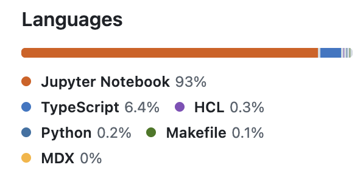

<!--
_class: cover
_paginate: false
_backgroundImage: "linear-gradient(90deg, rgba(0, 0, 0, 0.88) 0%, rgba(0, 0, 0, 0.55) 45%, rgba(0, 0, 0, 0) 80%), url(https://cdn.prod.website-files.com/6050a76fa6a633d5d54ae714/60db42e458a2686322b441ef_imagery-4.jpeg)"
-->

# Geospatial pipelines with Kedro

Reproducible and scalable geospatial data workflows.

Biel Stela Ballester — biel.stela@vizzuality.com

---

<!--_class: divider -->

Get the slides at

`https://vizzuality.github.io/oem-kedro-workshop`


---
<!-- _footer: " * therefore the context of this workshop and why we are using kedro." -->
## The Context at Vizzuality*


1) Team of 10 scientits and data engineers.
2) Multiple projets at time with 1~3 persons allocated.
3) Huge diversity of projects with completely different kinds of data.
4) From small .csv to 100 GBs of EO data.

---

## Geospatial data pipelines 

1. Geospatial projects tend to turn into a pile of notebooks, scripts and shell commands.
2. People have different backgrounds.
3. Teams have different levels of software engineering skills.



---

## Geospatial data pipelines

  1. `make` this, `make` that. 

---
<!-- _class: split -->
## Why Kedro?

Opinionated is framework that streamlines and organizes data pipeline projects around software engineering "best practices" and standard python project layout.

1. **Data Catalog** Every dataset declared in one place
2. **Pipelines and Nodes** Pure Python functions wired into a DAG
3. **Reproducibility** Same inputs give the same outputs

---
<!-- _class: split divider -->
## `kedro`

start with `kedro new -n example`

```
.
├── conf
│  ├── base
│  │  ├── catalog.yml
│  │  └── parameters.yml
│  ├── local
│  │  └── credentials.yml
│  └── logging.yml
├── data
│  ├── 01_raw
│  ├── 02_intermediate
│  └── 03_primary
├── src
│  └── example
│     ├── pipeline_registry.py
│     ├── pipelines
│     └── settings.py
├── tests
│  ├── __init__.py
│  └── pipelines
├── pyproject.toml
├── README.md
├── requirements.txt
└── uv.lock
```

---

<!-- _class: split -->

## The example

How protected is the Iberian lynx?

What share of *Lynx pardinus* observations in Spain fall inside **Natura 2000** sites?

- **GBIF** observations: CSV with lat/lon
- **Natura 2000** Habitats Directive sites: GeoPackage

```
observations ──► to_points ──► reproject ──┐
                                           ├──► flag_protected ──► summarise
natura2000 ─────────────────► reproject ───┘
```

---

<!-- _class: split -->

## The Data Catalog

Record of all the I/O datasets.

```yaml
# conf/base/catalog.yml
lynx_observations:
  type: polars.CSVDataset
  filepath: data/01_raw/lynx_observations.csv

natura2000_sites:
  type: geopandas.GenericDataset
  filepath: data/01_raw/natura2000_es.gpkg
  file_format: file

lynx_points_flagged:
  type: geopandas.GenericDataset
  filepath: data/03_primary/lynx_points_flagged.parquet
  file_format: parquet
```

---

<!-- _class: split -->

## Nodes are plain functions

**No I/O** inside the function, so it's easy to test with tiny sample data.

```python
# src/simple_example/pipelines/lynx/nodes.py
import geopandas as gpd


def reproject(gdf: gpd.GeoDataFrame, crs: str) -> gpd.GeoDataFrame:
    return gdf.to_crs(crs)


def flag_protected(
    points: gpd.GeoDataFrame, sites: gpd.GeoDataFrame
) -> gpd.GeoDataFrame:
    inside = gpd.sjoin(points, sites, predicate="within").index.unique()
    points = points.copy()
    points["in_protected"] = points.index.isin(inside)
    return points
```

---

<!-- _class: split -->

## Wiring the pipeline

Nodes connect through dataset names. Kedro works out the run order.

```python
# src/simple_example/pipelines/lynx/pipeline.py
from kedro.pipeline import Pipeline, node


def create_pipeline(**kwargs) -> Pipeline:
    return Pipeline([
        node(to_points, "lynx_observations", "lynx_points"),
        node(reproject, ["lynx_points", "params:target_crs"],
             "lynx_points_projected"),
        node(reproject, ["natura2000_sites", "params:target_crs"],
             "natura2000_projected"),
        node(flag_protected,
             ["lynx_points_projected", "natura2000_projected"],
             "lynx_points_flagged"),
        node(summarise, "lynx_points_flagged", "protection_summary"),
    ])
```

---

<!-- _class: split -->

## Parameters

Parameters go to the `parameters.yml` files, which is namespaced by `env` and easy to change.

```yaml
# conf/{env}/parameters.yml
target_crs: "EPSG:3035"
```

---

<!-- _class: divider -->
<!-- _paginate: false -->

## Demo: the resulting DAG

`kedro viz`

---

## What doesn't work so well

TODO


---

## Takeaways

1. **Catalog, not code** Every dataset declared once
2. **Pure nodes** GeoDataFrame in, GeoDataFrame out
3. **Parameters** CRS, resolution, thresholds
4. **`kedro viz`**

---

<!-- _class: divider -->
<!-- _paginate: false -->

## Thank you

biel.stela@vizzuality.com
